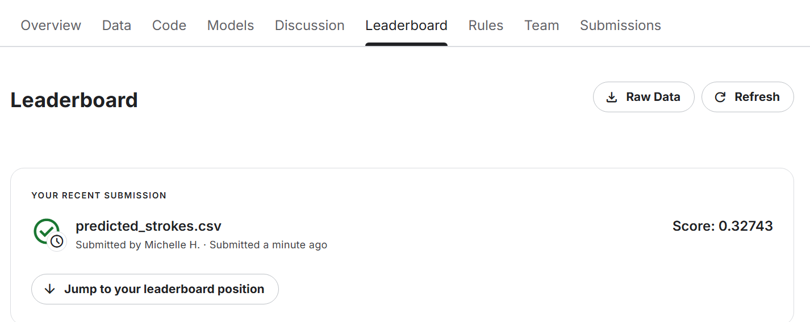

# Stroke Prediction Model

This project predicts stroke occurrences using Logistic Regression and KNN.

1. Data Collection 
The training and testing data came from a Kaggle public competition called the spring-2025-classification-competition. 

2. Data Preprocessing
I encoded the categorical data so that the categories appeared as 0 or 1 which works more accurately in a model. 
I dropped the stroke and id columns from the preprocessed file. Further, I looked to see whether there were variables
in a category that were part of the training dataset and not part of the testing dataset and vice versa.

3. Feature Engineering
I created the following new features:
- BMI Category - if bmi < 18.5 then Underweight; if bmi <25 then Normal; if bmi < 30 then Overweight else Obese.
- Glucose Category - assuming this is the fasting glucose, if <100 then Normal; if < 126 then Prediabetes else Diabetes.
- Age Category - if age is less than 18 then Child; if < 35 then Young Adult; if < 50 then Middle-Aged; if <65 then Older Adult else Senior.

4. Model Selection
I tried logistic regression and KNN, noting that the logistic regression was far more accurate at predicting stroke, though both did poorly. 

5. Training and Tuning
I performed the following steps to help train/ tune the model:
- Split the data (divided the training data as 80% training and 20% validation)
- In "class_weight = 'balanced', I adjusted the weights of classes based on their frequency in the data. As positive cases of stroke are rare, this piece ensures the model doesn't ignore the minority class (where stroke = 1)
- In "penalty='l2", a penalty term is given to prevent overfitting (ridge regularization)
- Tuned the threshold to improve recall/ F1 score. Specifically, I looked at a variety of thresholds and calculated recall, precision and the F1 score for each. Then the threshold with the highest F1 score was chosen. This can help minimize false negatives which is more important (not missing strokes).

6. Evaluation metrics on training/validation split
Using the best possible threshold (0.78), where if the predicted probability of stroke is greater or equal to 0.78 then it is stroke (1) otherwise, not stroke. With this threshold, I got the following results:
- Accuracy: 0.8930 (89.3% of predictions are correct)
- Precision: 0.1985 (19.85% of predicted stroke were actual strokes so many false positives)
- Recall: 0.5248 (52.5% of true strokes were identified)
- F1: 0.2880 (balances false positives and false negatives)
- AUC: 0.8625 (since near 1, indicates strong ability to identify stroke vs. non-stroke)

As we can see above, since AUC is relatively high, the model performs well. Precision is lower, indicating patients may be predicted as having a stroke incorrectly.

Screenshot of Kaggle leaderboard ranking:

Kaggle Leaderboard Screenshot

Short reflections/ lessons learned:
I learned that it is a balancing act. For example, to reduce the number of false negatives (where stroke is not identified and should have been), it has resulted in more false positives (patients inaccurately being labeled as a stroke risk).

